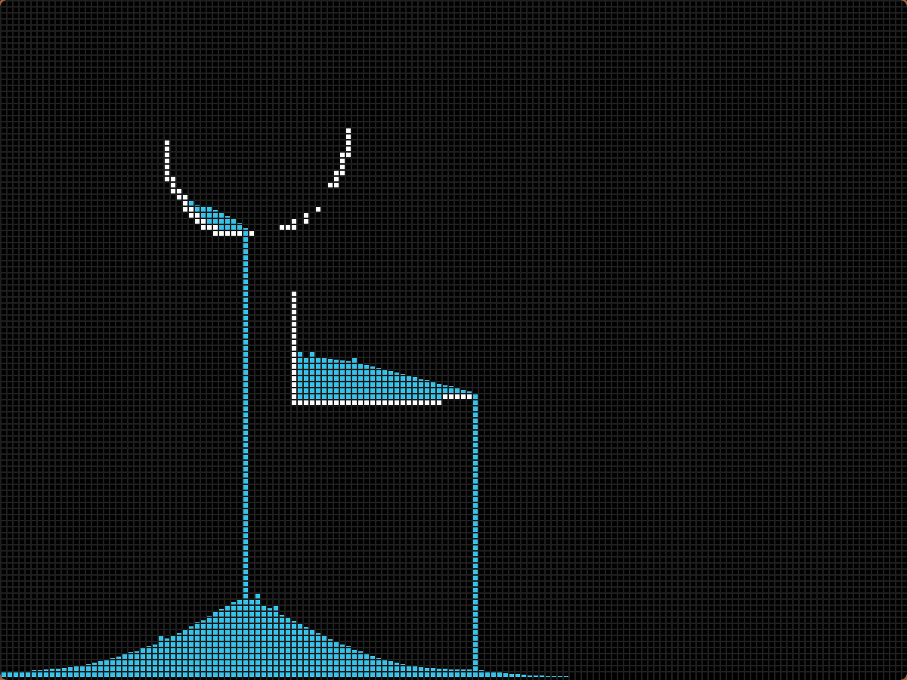

A 2D liquid simulator with cellular automaton, written in C using SDL2.

The logic is based off of 3 rules, found here: https://www.jgallant.com/2d-liquid-simulator-with-cellular-automaton-in-unity/

To compile and run the program:
* You need to have SDL2 installed, found here: https://wiki.libsdl.org/SDL2/Installation
* Make the build directory -> mkdir build
* Change to the build directory -> cd build
* Run the CMake -> cmake ..
* Run the make command -> make
* Run the program -> ./FluidSim

Left click to place a solid cell, press space bar to switch to placing water cells
To toggle delete mode, press backspace

To change the amount of cells, increase the CELL_SIZE defined at the top of fluid.c

